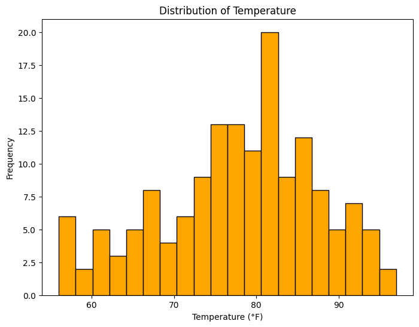

## This is a markdown title

in markdown we can create lists:

- item 1
- item 2
- item 3

also we can create enumerated list

1. Hola
2. Hi
3. Namaste

we can do **bold**, also *italic*


```python
# List are native to Python
import numpy as np
print(np.absolute(-1))
arr = np.array([1, 2, 3, 4, 5])
print(arr)
```

    1
    [1 2 3 4 5]
    


```python
# List are native to Python
my_list = [1, 2, 3, 4, 5]
print (my_list)
```

    [1, 2, 3, 4, 5]
    


```python
# We will be using a lot of data frames, so we need pandas library
# Panda allows us to make small spreadsheets, there will be rows and columns
import pandas as pd
data = {'Ozone': [41, 36, 12], 'Temp': [67, 72, 74]}
df = pd.DataFrame(data)
print(df)
```

       Ozone  Temp
    0     41    67
    1     36    72
    2     12    74
    

## 4. Loading CSV files
To load files into a `DataFrame` , we use the pandas function
`read_csv`;


```python
# Load and analyze data from a CSV file named airquality_datasets.csv using the pandas library
df = pd.read_csv('airquality_datasets.csv')
```


```python
# df.info () -> displays the structure and non-null counts of the DataFrame.
# df.describe () -> provides summary statistics such as mean, standard deviation, minimum, and maximum values for each column.
print(df.info())
print(df.describe())
```

    <class 'pandas.core.frame.DataFrame'>
    RangeIndex: 153 entries, 0 to 152
    Data columns (total 6 columns):
     #   Column   Non-Null Count  Dtype  
    ---  ------   --------------  -----  
     0   Ozone    116 non-null    float64
     1   Solar.R  146 non-null    float64
     2   Wind     153 non-null    float64
     3   Temp     153 non-null    int64  
     4   Month    153 non-null    int64  
     5   Day      153 non-null    int64  
    dtypes: float64(3), int64(3)
    memory usage: 7.3 KB
    None
                Ozone     Solar.R        Wind        Temp       Month         Day
    count  116.000000  146.000000  153.000000  153.000000  153.000000  153.000000
    mean    42.129310  185.931507    9.957516   77.882353    6.993464   15.803922
    std     32.987885   90.058422    3.523001    9.465270    1.416522    8.864520
    min      1.000000    7.000000    1.700000   56.000000    5.000000    1.000000
    25%     18.000000  115.750000    7.400000   72.000000    6.000000    8.000000
    50%     31.500000  205.000000    9.700000   79.000000    7.000000   16.000000
    75%     63.250000  258.750000   11.500000   85.000000    8.000000   23.000000
    max    168.000000  334.000000   20.700000   97.000000    9.000000   31.000000
    

## Instant data view
- JupyterLab allows us to instantly view the structure and data types of the columns within the DataFrame by using df.info(). This displays a concise summary of each column, including the number of non-null entries and the type of data (e.g., float64, int64).
- This feature makes it easy to verify that the data types (like floats for Temp, Ozone, Wind, etc.) align with the expected values from the CSV file, ensuring the data is in the correct format for further analysis and visualization.


```python
import matplotlib.pyplot as plt

# Ozone Histogram
plt.figure(figsize=(8, 6))
plt.hist(df['Ozone'].dropna(), bins=20, color='blue', edgecolor='black')
plt.title('Distribution of Ozone Levels')
plt.xlabel('Ozone (ppb)')
plt.ylabel('Frequency')
plt.show()

# Temp Histogram
plt.figure(figsize=(8, 6))
plt.hist(df['Temp'].dropna(), bins=20, color='orange', edgecolor='black')
plt.title('Distribution of Temperature')
plt.xlabel('Temperature (°F)')
plt.ylabel('Frequency')
plt.show()
```


    

    


    

    


## Visual Insights
- We can quickly identify trends and the spread of values.
- Peaks in the histograms indicate where data points are densely clustered, revealing common or typical readings in the dataset.
